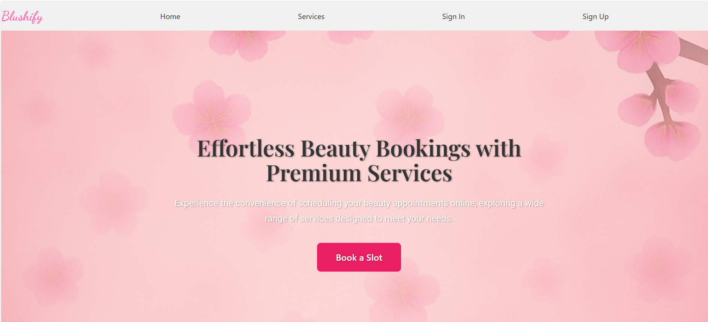
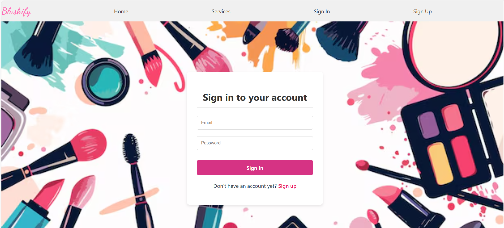
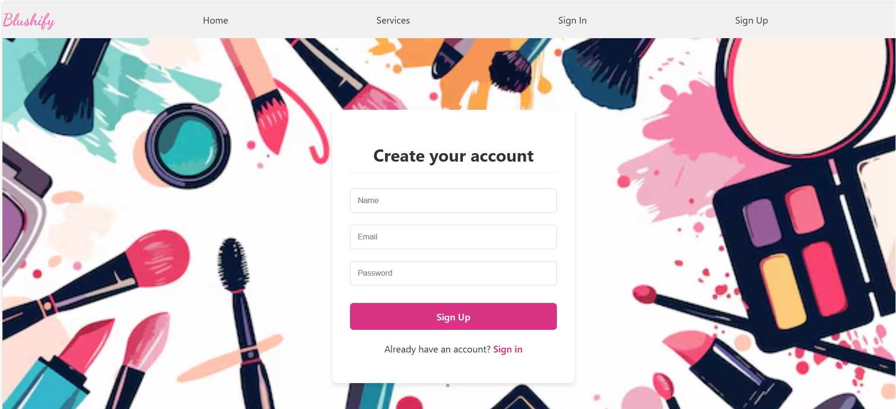
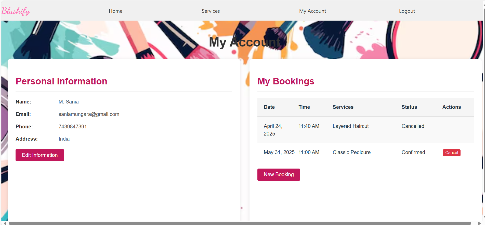
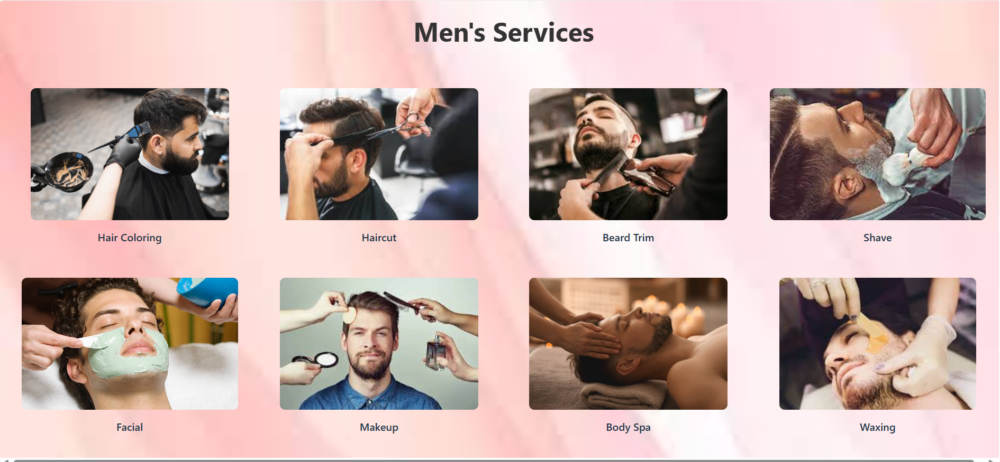
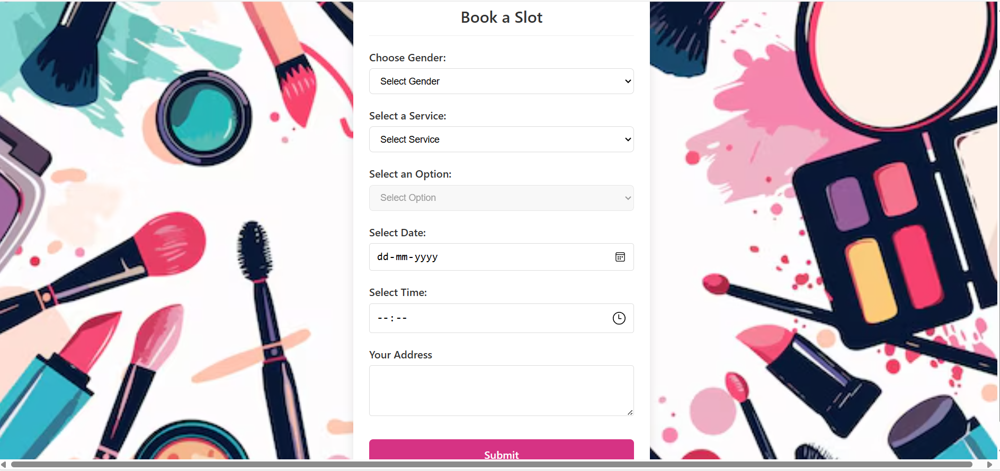

# Beauty Services Booking Web Application 
A full-stack e-commerce application designed to manage user profiles and booking services with ease and security.  
## Features  
- **User Authentication:** Secure signup and login with encrypted passwords.  
- **Profile Management:** Easily view and update personal details including name, email, phone, and address.  
- **Booking Management:** Create, view, and manage beauty service bookings seamlessly.  
- **Account Dashboard:** A centralized hub for managing profiles and bookings.  
- **Logout:** Safely log out from your account anytime.  
## 📸 Project Screenshots  
🏠 Homepage  
  
🔐 Sign In  
  
📝 Sign Up  
  
👤 My Account  
  
👨 Men Services  
  
👩 Women Services  
  
📅 Booking Slot  
  
## Project Overview  
The project is divided into two main parts:  
### Backend  
Handles API endpoints, user authentication, booking logic, and database operations.  
### Frontend  
A sleek React-based user interface for seamless interaction with the backend, including forms, navigation, and responsive design.  
## Tech Stack  
| Backend                         | Frontend                     |  
|---------------------------------|------------------------------|  
| Node.js                         | React.js                     |  
| Express.js                      | axios                        |  
| MongoDB (with Mongoose)         | @radix-ui/react-label        |  
| JWT for Authentication          | @radix-ui/react-slot         |  
| bcryptjs                        | classnames / clsx            |  
| CORS, dotenv, express-validator | formik, lucide-react         |  
|                                 | react-datepicker             |  
|                                 | react-router-dom             |  
|                                 | tailwind-merge, yup          |  
## How to Clone and Setup  
1. Open your terminal or command prompt.  
2. Clone the repository:  
`git clone https://github.com/saniamungara/beauty-service-booking-mern.git`  
3. Navigate into the project folder:  
`cd beauty-service-booking-mern`  
4. Backend Setup:  
`cd backend`  
`npm install`  
Create a `.env` file with:  
`PORT=5000`  
`MONGODB_URL=<Your MongoDB Connection String>`  
`JWT_SECRET=<Your Secret Key>`  
Start backend:  
`npm run start`  
5. Frontend Setup:  
`cd ../frontend`  
`npm install`  
`npm run dev`  
6. Visit the frontend in your browser (usually http://localhost:3000).  
## 👥 Team Members  
- **Sania Mungara**  
- **K. Sravya**  
- **G. Harshitha**  
- **P. Vigneswari**  
- **Rabiya Basreen**  
- **V. V. S. Sagarika**  
## 🔗 LinkedIn  
[Sania Mungara on LinkedIn](https://www.linkedin.com/in/sania-mungara-062204254/)  
## ⭐️ Show Your Support  
If you found this project helpful, feel free to ⭐️ this repository and share it with others!
