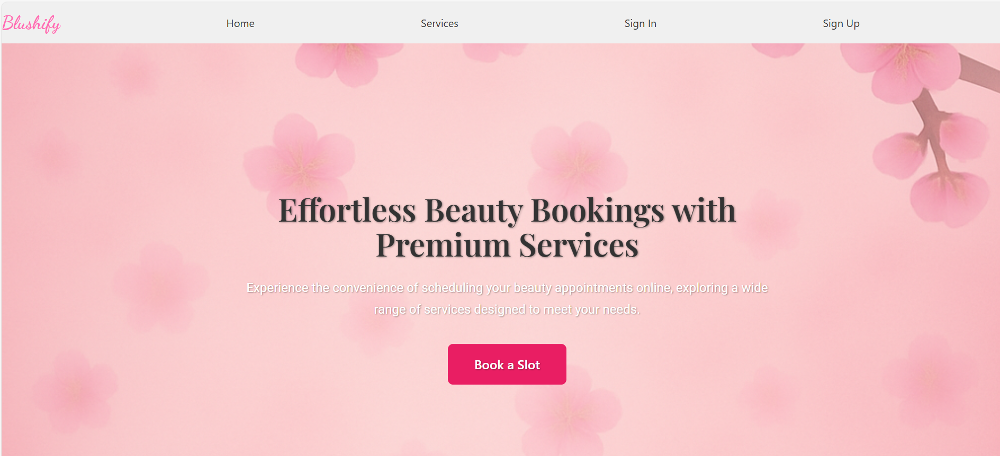
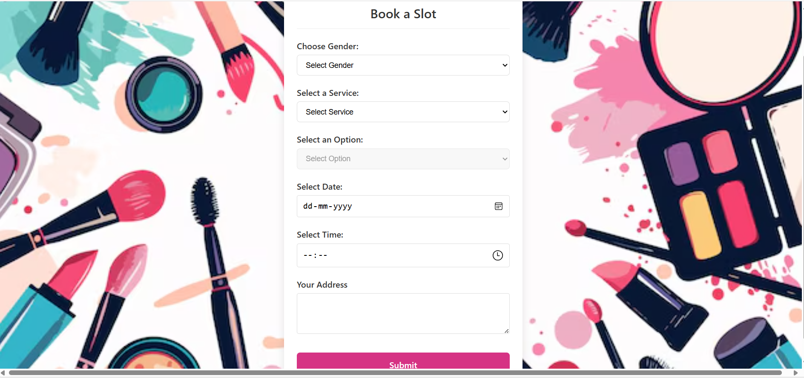

# 💄 Blushify - Online Beauty Service Booking Platform

Blushify is a full-stack MERN application designed to offer convenient at-home beauty services for men and women. Users can browse services, book appointments, and manage their profiles with ease.

---

## Features

- **User Authentication:** Secure signup and login with encrypted passwords.  
- **Profile Management:** View and update personal details including name, email, phone, and address.  
- **Booking Management:** Create, view, and manage beauty service bookings.  
- **Account Dashboard:** Centralized interface to manage user data and bookings.  
- **Logout Functionality:** Securely end user sessions.

---

## 📸 Project Screenshots

### 🏠 Homepage  


### 🔐 Sign In  


### 📝 Sign Up  


### 👤 My Account  


### 👨 Men Services  


### 👩 Women Services  


### 📅 Booking Slot  


---

## Project Overview

The project is divided into two major components:

### Backend

- Handles authentication, user data, booking logic, and database operations.

### Frontend

- Built with React.js, offers a user-friendly interface for seamless navigation and interaction.

---

## Tech Stack

| Backend                         | Frontend                     |
|---------------------------------|------------------------------|
| Node.js                         | React.js                     |
| Express.js                      | axios                        |
| MongoDB with Mongoose           | @radix-ui/react-label        |
| JWT (Authentication)            | @radix-ui/react-slot         |
| bcryptjs                        | classnames / clsx            |
| dotenv, cors                    | formik, lucide-react         |
|                                 | react-datepicker             |
|                                 | react-router-dom             |
|                                 | tailwind-merge, yup          |

---

## 🚀 Getting Started

### 1. Clone the Repository

```bash
git clone https://github.com/saniamungara/Micro_IT_Project.git
cd Micro_IT_Project/Micro_IT_ECommerce_Project
```

### 2. Backend Setup

```bash
cd backend
npm install
```

Create a `.env` file:

```
PORT=5000
MONGODB_URL=your_mongodb_uri
JWT_SECRET=your_jwt_secret
```

Start the server:

```bash
npm run start
```

### 3. Frontend Setup

```bash
cd ../frontend
npm install
npm run dev
```

Navigate to `http://localhost:3000` to use the app.

---

## 👥 Team Members

- **Sania Mungara**  
- **G. Sai Harshitha**   
- **K.Sravya**  
- **P.Vigneswari**
- **Rabiya Basreen**   
- **V.V.S.Sagarika**

---

## 🌐 Connect

Feel free to connect with me on [LinkedIn](https://www.linkedin.com/in/sania-mungara-062204254) for collaborations or feedback!
